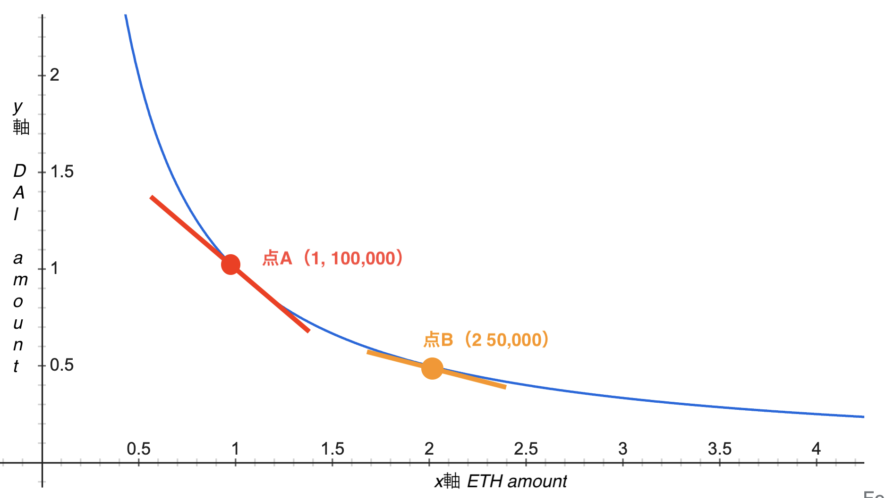

# SimpleなDEXを作ってみる

## Steps
1. DEXとは？
2. AMMとは？
3. AMMの仕組み
4. DEXコントラクトの関数
5. DEXの動作確認

## 1. DEXとは？
Decentralizedな暗号資産の取引所のことです。有名どころでは、UniswapやPancakeswap、0xなどが挙げられます。DEXと対を成すのが、CEXで、Centralizedな取引所のことです。有名どころでは、BitflyerやCoincheck、Binanceが挙げられます。
DEXには多様な方式があります。DEXが現れた当初は、証券取引の板取引のようなOrderBookがあって、買い手と売り手をマッチングさせるようなものが主流でした。しかし、UniswapやPancakeswapのようなAMMと呼ばれる手法が登場すると、DEXの主流に取ってかわりました。

## 2. AMMとは？
AMMはAutomated Market Makerの略で、売り手に当たるものが自動化されることが最大の特徴です。通常の取引を考えた場合、買い手一人では売買は成立せず、売り手の存在が不可欠です。買い手は、自分の満足する価格の売り手が現れるのを待つ必要があります。一方、AMMでは、売り手が自動化されているので、買い手はいつでも買いたいときに買いたい分だけ、暗号資産を購入できます。この点が革命的と言えます。
例えば、BitcoinやEthereumのような人気の高い暗号資産の場合、買い手も売り手も十分数存在するので、買いたいときにいつで買える状態が作られます。一方、名前の知られていないマイナーな暗号資産の場合、買い手も売り手も不足しているので、トレードがなかなか成立しないという事態が発生します。このようなケースに光明を差し込むのがAMMと言えます。


## 3. AMMの仕組み
簡単に説明すると２ステップに分かれます。

AMMでは売り手がいなくても、トレードが成立しますが、その原資はどこから来るかというと、複数の第三者から提供されて、Poolされています。例えば、ETHとDAIに交換したい場合は、ETHとDAIの両方を持ってる第三者が提供してPoolします。第三者が資産を提供するメリットは、売買の手数料報酬を得ることです。

次に、買い手は購入したい量を指定します。すると、価格が自動的に決まります。この価格が決まるメカニズムは、需要と供給により価格が決まる仕組みと同じです。例えば、ETHからDAIに交換する人が増えた場合、いいかえると、DAIの需要が高い場合は、PoolされていDAIの量が少なくなります。量が少なくなるということはDAIの方が希少なので、DAIの価格が高くなり、ETHの価格が下落します。このように、需要と供給、Poolされている資産の割合の増減によって価格が決まります。

### 流動性の供給
最初の原資をPoolすることを`流動性を供給する`とAMM的に表現します。前述のマイナーな通貨で売り手と買い手が少なくトレードが成立しない状態を`流動性がない`と呼びます。AMMによって`流動性を作る`ことで売買を成立させます。
流動性を供給すると流動性トークン(`LiquidityToken`)がMintされます。この流動性トークンの量は、供給した流動性の量に比例します。もし、供給した流動性を手元に戻したい場合は、この流動性トークンをBurnします。

#### 具体例：Mint
具体的にETHとDAIを流動性として供給する場合を考えてみます。
ここで、ETHはそのままETHではなく、ERC20でWrapedしたTokenの形のWraped ETH(WETH)として表現します。
最初にWETHを1枚、DAIを100,000枚を供給するとすると、Mintされる流動性トークン（LPトークン）の量はこのように計算されます。
```sh
sqrt(WETH * DAI) = LP Token
sqrt(1 * 100,000) = 316
```
両者を掛けたものの二乗根を取り、316枚のLPトークンがMintされます。

次に、WETHを2枚、DAIを100,000枚を供給したいとします。
しかし、WETHは１枚しか供給できません。WETH２枚を供給したいならが、DAIを追加で100,000枚用意する必要があります。
理由は、流動性プールの通貨比率が一定に保たれるからです。
```sh
additional WETH * reserved DAI / reserved WETH = required DAI
2 * 100,000 / 1 =  200,000
```
ということで、実際に供給される流動性はWETHが１枚とDAIが100,000枚づつです。
Mintされる流動性トークンの量は、新たに供給される流動性の量と、供給されている流動性の比率にLPトークンの総量を掛けたものになります。
```sh
total LP Supply * additional DAI / reserved DAI = additional LP Token
316 * 100,000 / 100,000 = 316
```
新規に流動性を供給したときと同じく316枚がMintされます。

#### 具体例：Burn
続いて、Burnする場合を考えてみます。
先ほど追加で供給した316枚のLPトークンをBurnすることを考えます。
すると、返却されるWETHとDAIの量は、burnされるLPトークンとLPトークンの総量の比率に供給されているトークン量を掛けたものにないrます。
```sh
# WETH
reserved WETH * burn LP token / total LP Supply =  Backed WETH
2 * 316 / 632 = 1

# DAI
reserved DAI * burn LP token / total LP Supply =  DAi WETH
200,000 * 316 / 632 = 100,000
```
それぞれ、WETHが１枚、DAIが100,000枚、返却されます。

### 価格の決定
AMMでの価格決定の方法は有名な`k = x * y`という式よって表されます。`x`と`y`がそれぞれ供給された流動性の量を表します。`k`は定数で、一定の値です。流動性の量の積は一定に保たれるということを表しますが、この式を変形するとわかりやすいです。　これを変形すると、`y = k / x`でお馴染み、反比例の式が姿を表します。流動性Xが増えると、反比例する形で流動性yが減少します。

具体的にWETHとDAIの取引を例に、X軸をETHの供給量、y軸をDAIの供給量としてグラフを引いてみます。



点Aを初期状態を考えます。点AではETHが１枚、DAIが100,000枚供給されています。これは、１枚のETHと１０万枚のDAIの価値が釣り合っている状態です。言い換えると、ETH１枚が１０万DAIに値するので、つまり、ETHの価格は１０万DAIということです。グラフの傾きが価格を表します。

ここから、ETHが売られて、DAIが買われる動きが加速したとします。直感的には、DAIの価値が高い状況なので、ETHの価格が下落します。グラフで表すと、点Aから点Bへ移行したとします。ETHの供給量は２倍に増え、DAIの供給量は半分に減りました。２枚のETHと５万枚のDAIが同じ価値なので、ETHの価格は、２万５千DAIです。確かに、ETHの価格が下落していることがわかります。グラフの傾きを見れば明白です。


## 4. DEXコントラクトの関数
AMMの仕組みがわかったところで、より具体的にDEXコントラクトの関数について解説します。

本実装では主に２つのコントラクトが存在します。１つ目の[SimpleDex.sol](./SimpleDex.sol)がDEXに相当するコントラクトで、２つ目の[LiquidityToken.sol](./LiquidityToken.sol)が流動性トークンに相当するコントラクトです。流動性トークンについては、ほぼERC20と同じです。ただ、`swap`関数が実装されている点が特徴的です。また、mint時に供給された流動性分のトークンを発行したり、burn時に同等量の流動性を返却したりと、流動性トークンらしい実装が為されています。

DEXコントラクトの主要な関数はこちらです。
- `addLiquidity`: 流動性を供給する（Mint）
- `removeLiquidity`: 流動性を引き抜く（Burn）
- `swap`: 暗号資産とトレードする


## 5. DEXの動作確認
それでは、実際にコントラクトをデプロイして、一連の関数の動作確認をしてみます。

1. コントラクトのデプロイ
    - WETHとDAIに当たる２つの[ERC20](./MockERC20.sol)をデプロイします。
        - Deployerにそれぞれ、1億をmintします。
    - [Dexコントラクト](./SimpleDex.sol)をデプロイします。

3. 流動性の供給
    - mintした全量をDEXコントラクトに対してApproveします。
    - 初期の流動性としてWETHを10枚、DAIを100万供給します。つまり、ETHの価格が10万DAIの場合です。
        - LPトークンが`3162`枚発行されます

4. トレード
    - 別のアカウントにETHをmintします
    - DEXコントラクトをApproveします
    - 1WETHを売ってDAIを買うトレードを行います。
      - 手数料が徴収されて`90661`DAIを受け取ります
    - 全く同じトレードをもう一度行います。
      - すると、`75569`DAIを受けとりました。ETHの価格が下落していることがわかります。

5. 流動性の引き抜き
    - DEXコントラクトに対して、LPトークンをApproveします
    - 半分の流動性(`1581`)を引き抜きます。
        - `6`WETHと`416885`DAIを受け取ります。
