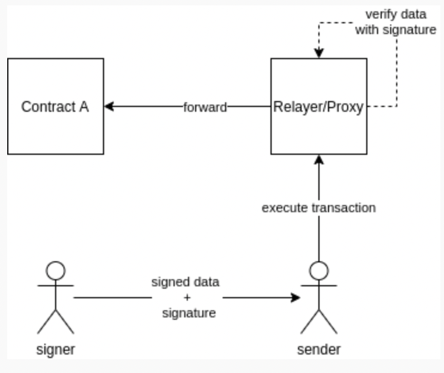

# ガス代を肩代わりするmeta transactionのRelayerを作ってみる

## Steps
1. meta transactionとは
2. calldataの作り方
3. meta transactionの実行の仕方
4. 簡単な名簿コントラクトを作り、meta transactionで実行してみる

## 1. meta transactionとは
一言でいうと「実際に実行したい処理のトランザクション」をラップしたトランザクションです。ラップすることで`実際に実行したい処理`のガス代を肩代わりすることが可能です。`実際に実行したい処理`は、その処理を実行させたいユーザによって署名されていて、そのユーザのコンテキストで実行されます。

例えば、とあるDappsの運営者が、Ethereumウォレットの扱いに不慣れであったり、ETHを所有していなユーザも取り込みたい場合に使われます。ガス代を支払うのDapps運営者で、Dapps利用者はガス代支払うことなく、サービスを利用できます。

### コントラクトの構成
こちらのブログ（[Ethereum Meta-Transactions 101](https://medium.com/coinmonks/ethereum-meta-transactions-101-de7f91884a06)）から借用させていただきました。
ContractAを実行するために、Relayerコントラクトを経由します。Singerはcalldataとその署名をSenderに渡し、Senderが実際のトランザクションを発行します。


## 2. calldataの作り方
meta transactionのcalldataの作り方を具体的なjavascriptのコードを使って解説します。
ライブラリとしては最もポピュラーな[web3.js](https://web3js.readthedocs.io/en/v1.8.0/)を使います。

1. まず、実行したい関数のコールデータを作ります。後述する名簿コントラクトに新しく`tom`というメンバーを追加するためのものです。
```javascript
// 関数のcalldataを作る
const name = "tom";
const age = 21;
const isMale = true;
const abiEncodedCall = web3.eth.abi.encodeFunctionCall({
  name: 'regist',
  type: 'function',
  inputs: [
    {type: 'string', name: 'name' },
    {type: 'uint8', name: 'age' },
    {type: 'bool', name: 'isMale' },
  ]
}, [name, age, isMale]);
```

2. コールデータのハッシュ値を計算します。コールデータ自体に署名するのではなくハッシュ値に署名するのが慣習です。
```javascript
const hash = web3.utils.soliditySha3(abiEncodedCall);
```

3. 秘密鍵でハッシュ値に署名します。実はこの時、ハッシュ値自体に署名しているのではなく、ハッシュ値をラップしたものに署名しています。具体的には`"\x19Ethereum Signed Message:\n" + ハッシュ値.length + ハッシュ値`に対して署名しています。このラップはパスワードをハッシュ化するときのsaltと同様の役目があります。[web3.eth.accounts.sign](https://web3js.readthedocs.io/en/v1.8.0/web3-eth-accounts.html#sign)で署名すると、自動的にラップしてくれます。
```javascript
// 秘密鍵に対応するアドレス: 0xE3b0DE0E4CA5D3CB29A9341534226C4D31C9838f
const PRI_KEY = "d1c71e71b06e248c8dbe94d49ef6d6b0d64f5d71b1e33a0f39e14dadb070304a"
const wallet = web3.eth.accounts.privateKeyToAccount(PRI_KEY);
const sig = await web3.eth.accounts.sign(hash, wallet.privateKey);
```

## 3. meta transactionの実行の仕方
実際のsolidityのコードを参照しながら、[Relayer](./Relayer.sol)コントラクトでmeta transactionの実行の仕方を解説します。

1. まずは、署名を検証します。calldataのハッシュ値を作り、それをラップするところは、署名を作った時と同じです。Solidityでは、署名からSingerを復元することができます。それを行うのが`ecrecover`です。復元されたアドレスが、オリジナルのSender(ガス代を肩代わりしたいユーザ)のアドレスと一致することを確認します。
```solidity
// calldataのハッシュ値を計算
bytes32 hash = keccak256(data);
// hash値をメッセージでラップ
bytes32 ethSignedMessageHash = keccak256(abi.encodePacked("\x19Ethereum Signed Message:\n32", hash));
// ecrecoverでsingerを復元
address signer = ecrecover(ethSignedMessageHash, v, r, s);
// signerがオリジナルの実行者と同じであることを確認
bool ok = signer == sender;
```

2. calldataの末尾にオリジナルのSenderのアドレスを付与します。これは、callされる外部コントラクト側でオリジナルのSenderを復元できるようにするために行います。
```solidity
bytes memory cdata = abi.encodePacked(data, sender);
```

3. 外部コントラクトを実行します。`call`関数を呼び出すことで、外部コントラクトの関数が実行されます。
```solidity
(bool success, bytes memory returndata) = to.call(cdata);
```

## 4. 簡単な名簿コントラクトを作り、meta transactionで実行してみる
最後に、簡単なコントラクトを作って、meta transactionを試してみます。
作成するコントラクトはメンバーのリストを持つ名簿コントラクト（[MemberList](./MemberList.sol)）です。
名簿コントラクトの`regist`関数を実行します。

### Steps
1. Relayerコントラクトをデプロイ
2. 名簿コントラクトをデプロイ
    - デプロイ時にRelayerコントラクトのアドレスを指定します。Relayerから呼び出された場合に、`msg.sender`をcalldataの末尾から復元します。
3. calldataと署名を作る
    - `node sign.js`を実行します。コマンドラインにcalldataと署名が出力されます。
4. Relayコントラクトのexecute関数を実行します
　  - 正しい署名を提出すると、名簿コントラクトが呼び出されます。呼び出し結果が正常であれば、そのまま終了します。異常があればrevertします・
5. 名簿コントラクトに名簿が追加されたか確認します
    - list関数を呼び出して`tom`が登録されているか確認します。 
