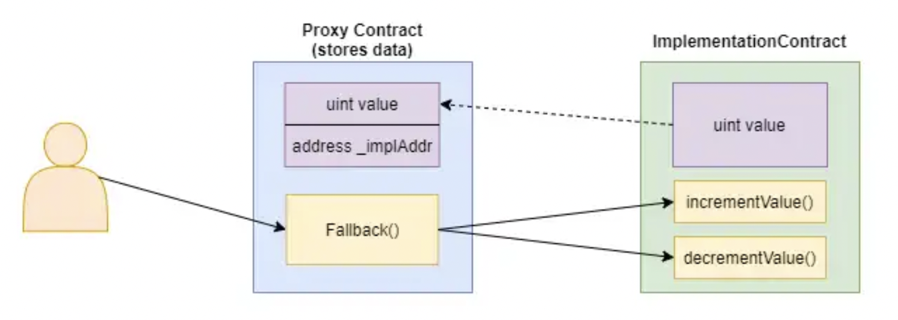

# Upgrade可能なコントラクトを作ってみる

## Steps
1. どうやってアップグレードするのか？
2. 具体的にどのような仕組みなのか？
3. 実装方法の解説
4. Bankコントラクトを作ってアップグレードしてみる

## 1. どうやってアップグレードするのか？
ロジックの部分を別のコントラクトに切り出しておき、ロジックコントラクトを切り替えることUpgradeを可能とします。スマートコントラクトはひとたびデプロイされたら変更することができません。しがたって、ロジックの部分を直接変更することができません。そこで、全く新しいコントラクトを新たに作り、そちらに切り替えることで、アップグレードを可能とします。

１点、注意すべき制約があります。それは`データ構造の変更は効かない`ということです。
ロジック部分を切り替える一方、データが格納されているストレージ部分は共通です。旧バージョンのストレージがそのまま新バージョンに引き継がれます。

## 2. 具体的にどのような仕組みなのか？
こちら（[Solidity: Upgradable Contracts, Tokens](https://www.blocksism.com/solidity-upgradable-token-contract/)）のブロブの画像をお借りして具体的な仕組みを解説します。

とあるカウンターコントラクトをアップグレード可能な形で実装する場合を考えます。
カウンターコントラクトは`value`というカウンターを持ち、`incrementValue`でインクリメントされ、`decrementValue`でデクリメントされます。

カウンターコントラクト（`implementationContract`）をアップグレード可能な形にするには、Proxyコントラクトを間に噛ませます。Proxyコントラクトがカウンターコントラクトのロジックを実行し、結果を自身のストレージに格納します。
- Proxyコントラクトのfallback関数を経由して、カウンターコントラクトの２つの関数が呼び出されます
  - fallback関数は「存在しない関数が呼ばれたときに実行される」ものです
  - Proxyコントラクトには存在しない`incrementValue`や`decrementValue`を呼び出そうとしたときに、結果的に、このfallback関数をが呼ばれます
    - fallback関数内でカウンターコントラクトの関数を呼び出します
- 関数を実行した結果、変更されたカウンター（value）の新しい値を、Proxyコントラクト自体に格納します
  - Proxyコントラクトはデータを格納するストレージの役割を果たします
- Proxyコントラクトはvalue等、呼び出し先コントラクトのデータ以外にも`どのコントラクトを呼び出すか（_implAddr）`を保持します



呼び出し先コントラクトのアドレス(_implAddr)を新しいカウンターコントラクト(`implementationContractV2`)に切り替えます。Proxyコントラクト自体は変更されていないので、ストレージは保持されたままで、ロジック部分だけ新しいコントラクトに切り替わります・


## 3. 実装方法の解説
肝になるは`delegatecall`という関数です。これは、呼び出し先のコントラクトをあたかも自分のコントラクトであるかのように呼び出す関数です。通常、外部コントラクトを呼び出し何かしら変更を加えた場合、変更は外部コントラクトに適応されます。しかし、delegatecallの場合は、自分のコントラクトに適応されます。

実装例としては、このような形になります。`delegatecall`の部分に注目すると、メモリにコピーしたcalldataをもとに、`_implementation`という外部コントラクトを呼び出します。
```solidity
assembly {
    // calldataをメモリにコピーする
    calldatacopy(0, 0, calldatasize())

    // delegate callの実行
    // delegatecall(消費可能なガス残量, 呼び出し先, メモリオフセット, メモリサイズ, 実行結果オフセット、実行結果サイズ)
    // 実行結果のサイズは不明なのでゼロを指定
    let result := delegatecall(gas(), _implementation, 0, calldatasize(), 0, 0)

    // 実行結果をメモリにコピー
    returndatacopy(0, 0, returndatasize())

    switch result
    // 戻り値が“０”の場合は失敗なのでrevert
    case 0 {
        revert(0, returndatasize())
    }
    // 戻り値が“１”の場合は成功なので、結果を返却
    default {
        return(0, returndatasize())
    }
}
```

delegatecallを使う上で注意すべき点は「ストレージ変数のコンフリクト」です。
ストレージ変数とは、ストレージに格納される変数です。ローカル変数と異なり、永続化されます。
例えば、以下のコントラクトの`account`や`age`や`isMale`です。
Ethereumでは、このストレージ変数が順番に2^256個のスロットに割り当てられていきます。
`account -> slot1`, `age -> slot2`, `isMale -> slot3`といった形です。
```solidity
contract OuterContract {
    address public account; // <- slot1
    uint8 public age;       // <- slot2
    bool public isMale;     // <- slot3
}
```

下の`UpgradableContract`の外部関数として上の`OuterContract`をdelegatecallすると「ストレージ変数のコンフリクト」が発生します。UpgradableContractの`owner`とOuterContractの`account`がコンフリクトします。
delegatecallによる変更を、呼び出し先のコントラクトに適応される際に、ストレージのレイアウトは引き継がれます。
したがって、UpgradableContractを実装するときは、OuterContractのストレージレイアウトとコンフリクトしないように注意する必要があります。
```solidity
contract UpgradableContract {
    address public owner; // <- slot1
}
```

ちなみに、配列やmapのslotはとある規則に従ったハッシュ値から算出されます。[Layout of State Variables in Storage](https://docs.soliditylang.org/en/v0.8.16/internals/layout_in_storage.html#layout-of-state-variables-in-storage)にまとまっているので、興味のある方は見ておいてください。

### EIP-1967: Proxy Storage Slotsについて
Upgrade可能なコントラクトを実装するには「呼び出し先のコントラクト」と「呼び出し先のコントラクトを変更できるオーナー」の最低２つのストレージ変数が必要です。これらをコンフリクトすることなく実装するための規格が[EIP-1967: Proxy Storage Slots](https://eips.ethereum.org/EIPS/eip-1967)です。

簡単に説明すると特定のSlotにそれぞれを格納するというものです。
「呼び出し先のコントラクト」を`0x360894a1...`に割り当て、「呼び出し先のコントラクトを変更できるオーナー」を`0xb5312768...`に割り当てます。
これらは特定の文字列のハッシュ値として計算されます。
```solidity
// "eip1967.proxy.implementation"のハッシュ値
//  bytes32(uint256(keccak256('eip1967.proxy.implementation')) - 1))
bytes32 internal constant _IMPLEMENTATION_SLOT = 0x360894a13ba1a3210667c828492db98dca3e2076cc3735a920a3ca505d382bbc;

// "eip1967.proxy.admin"のハッシュ値
//  bytes32(uint256(keccak256('eip1967.proxy.admin')) - 1))
bytes32 internal constant _ADMIN_SLOT = 0xb53127684a568b3173ae13b9f8a6016e243e63b6e8ee1178d6a717850b5d6103;
```

Solidityでは、ストレージ変数の格納先slotを指定することができます。
`AddressSlot`というstructの格納先slotに上述の`0x3608...`と`0xb531...`を指定する形です。
実際のアドレスは、AddressSlotの`value`の中に入ります。
```solidity
// 「呼び出し先のコントラクト」と「呼び出し先のコントラクトを変更できるオーナー」のアドレスを格納するstruct
struct AddressSlot {
    address value;
}

AddressSlot storage r;

// 0x3608... or 0xb531...
bytes32 slot;

// "AddressSlot"の変数rを格納するslotを指定する
assembly {
    r.slot := slot
}
```
`.slot`に扱いについて、詳しくは[Access to External Variables, Functions and Libraries](https://docs.soliditylang.org/en/v0.8.17/assembly.html#access-to-external-variables-functions-and-libraries)を参照ください。


## 4. Bankコントラクトを作ってアップグレードしてみる
試しにBankコントラクトを作って、アップグレードしてみます。

#### version 1のBankコントラクト

version 1のBankコントラクトの機能としては「バンク名を変更できる」「お金を入金できる」とします。
```solidity
contract BankV1 {

    string public name;

    uint256 public totalBalance;

    mapping(address => BankAccount) public bankAccounts;

    struct BankAccount {
        uint256 balance;
    }

    function setName(string memory newName) public {
        name = newName;
    }

    function deposit() public payable {
        totalBalance += msg.value;
        bankAccounts[msg.sender].balance = msg.value;
    }
}
```

#### version 2のBankコントラクト
version2で「お金を引き出せる」機能を追加します。
```solidity
contract BankV2 {
    ...
    function withdraw(uint256 amount) public {
        require(amount <bankAccounts[msg.sender].balance, "insufficient balance");

        bankAccounts[msg.sender].balance -= amount;
        payable(msg.sender).transfer(amount);

        totalBalance -= amount;
    }
}
```

### アップブレード手順

1. BankV1コントラクトをデプロイし、そのアドレスを引数にUpgradeProxyをデプロイします
2. 各種calldataを作る
# Upgrade可能なコントラクトを作ってみる

## Steps
1. どうやってアップグレードするのか？
2. 具体的にどのような仕組みなのか？
3. 実装方法の解説
4. Bankコントラクトを作ってアップグレードしてみる

## 1. どうやってアップグレードするのか？
ロジックの部分を別のコントラクトに切り出しておき、ロジックコントラクトを切り替えることUpgradeを可能とします。スマートコントラクトはひとたびデプロイされたら変更することができません。しがたって、ロジックの部分を直接変更することができません。そこで、全く新しいコントラクトを新たに作り、そちらに切り替えることで、アップグレードを可能とします。

１点、注意すべき制約があります。それは`データ構造の変更は効かない`ということです。
ロジック部分を切り替える一方、データが格納されているストレージ部分は共通です。旧バージョンのストレージがそのまま新バージョンに引き継がれます。

## 2. 具体的にどのような仕組みなのか？
こちら（[Solidity: Upgradable Contracts, Tokens](https://www.blocksism.com/solidity-upgradable-token-contract/)）のブロブの画像をお借りして具体的な仕組みを解説します。

とあるカウンターコントラクトをアップグレード可能な形で実装する場合を考えます。
カウンターコントラクトは`value`というカウンターを持ち、`incrementValue`でインクリメントされ、`decrementValue`でデクリメントされます。

カウンターコントラクト（`implementationContract`）をアップグレード可能な形にするには、Proxyコントラクトを間に噛ませます。Proxyコントラクトがカウンターコントラクトのロジックを実行し、結果を自身のストレージに格納します。
- Proxyコントラクトのfallback関数を経由して、カウンターコントラクトの２つの関数が呼び出されます
  - fallback関数は「存在しない関数が呼ばれたときに実行される」ものです
  - Proxyコントラクトには存在しない`incrementValue`や`decrementValue`を呼び出そうとしたときに、結果的に、このfallback関数をが呼ばれます
    - fallback関数内でカウンターコントラクトの関数を呼び出します
- 関数を実行した結果、変更されたカウンター（value）の新しい値を、Proxyコントラクト自体に格納します
  - Proxyコントラクトはデータを格納するストレージの役割を果たします
- Proxyコントラクトはvalue等、呼び出し先コントラクトのデータ以外にも`どのコントラクトを呼び出すか（_implAddr）`を保持します


呼び出し先コントラクトのアドレス(_implAddr)を新しいカウンターコントラクト(`implementationContractV2`)に切り替えます。Proxyコントラクト自体は変更されていないので、ストレージは保持されたままで、ロジック部分だけ新しいコントラクトに切り替わります・


## 3. 実装方法の解説
肝になるは`delegatecall`という関数です。これは、呼び出し先のコントラクトをあたかも自分のコントラクトであるかのように呼び出す関数です。通常、外部コントラクトを呼び出し何かしら変更を加えた場合、変更は外部コントラクトに適応されます。しかし、delegatecallの場合は、自分のコントラクトに適応されます。

実装例としては、このような形になります。`delegatecall`の部分に注目すると、メモリにコピーしたcalldataをもとに、`_implementation`という外部コントラクトを呼び出します。
```solidity
assembly {
    // calldataをメモリにコピーする
    calldatacopy(0, 0, calldatasize())

    // delegate callの実行
    // delegatecall(消費可能なガス残量, 呼び出し先, メモリオフセット, メモリサイズ, 実行結果オフセット、実行結果サイズ)
    // 実行結果のサイズは不明なのでゼロを指定
    let result := delegatecall(gas(), _implementation, 0, calldatasize(), 0, 0)

    // 実行結果をメモリにコピー
    returndatacopy(0, 0, returndatasize())

    switch result
    // 戻り値が“０”の場合は失敗なのでrevert
    case 0 {
        revert(0, returndatasize())
    }
    // 戻り値が“１”の場合は成功なので、結果を返却
    default {
        return(0, returndatasize())
    }
}
```

delegatecallを使う上で注意すべき点は「ストレージ変数のコンフリクト」です。
ストレージ変数とは、ストレージに格納される変数です。ローカル変数と異なり、永続化されます。
例えば、以下のコントラクトの`account`や`age`や`isMale`です。
Ethereumでは、このストレージ変数が順番に2^256個のスロットに割り当てられていきます。
`account -> slot1`, `age -> slot2`, `isMale -> slot3`といった形です。
```solidity
contract OuterContract {
    address public account; // <- slot1
    uint8 public age;       // <- slot2
    bool public isMale;     // <- slot3
}
```

下の`UpgradableContract`の外部関数として上の`OuterContract`をdelegatecallすると「ストレージ変数のコンフリクト」が発生します。UpgradableContractの`owner`とOuterContractの`account`がコンフリクトします。
delegatecallによる変更を、呼び出し先のコントラクトに適応される際に、ストレージのレイアウトは引き継がれます。
したがって、UpgradableContractを実装するときは、OuterContractのストレージレイアウトとコンフリクトしないように注意する必要があります。
```solidity
contract UpgradableContract {
    address public owner; // <- slot1
}
```

ちなみに、配列やmapのslotはとある規則に従ったハッシュ値から算出されます。[Layout of State Variables in Storage](https://docs.soliditylang.org/en/v0.8.16/internals/layout_in_storage.html#layout-of-state-variables-in-storage)にまとまっているので、興味のある方は見ておいてください。

### EIP-1967: Proxy Storage Slotsについて
Upgrade可能なコントラクトを実装するには「呼び出し先のコントラクト」と「呼び出し先のコントラクトを変更できるオーナー」の最低２つのストレージ変数が必要です。これらをコンフリクトすることなく実装するための規格が[EIP-1967: Proxy Storage Slots](https://eips.ethereum.org/EIPS/eip-1967)です。

簡単に説明すると特定のSlotにそれぞれを格納するというものです。
「呼び出し先のコントラクト」を`0x360894a1...`に割り当て、「呼び出し先のコントラクトを変更できるオーナー」を`0xb5312768...`に割り当てます。
これらは特定の文字列のハッシュ値として計算されます。
```solidity
// "eip1967.proxy.implementation"のハッシュ値
//  bytes32(uint256(keccak256('eip1967.proxy.implementation')) - 1))
bytes32 internal constant _IMPLEMENTATION_SLOT = 0x360894a13ba1a3210667c828492db98dca3e2076cc3735a920a3ca505d382bbc;

// "eip1967.proxy.admin"のハッシュ値
//  bytes32(uint256(keccak256('eip1967.proxy.admin')) - 1))
bytes32 internal constant _ADMIN_SLOT = 0xb53127684a568b3173ae13b9f8a6016e243e63b6e8ee1178d6a717850b5d6103;
```

Solidityでは、ストレージ変数の格納先slotを指定することができます。
`AddressSlot`というstructの格納先slotに上述の`0x3608...`と`0xb531...`を指定する形です。
実際のアドレスは、AddressSlotの`value`の中に入ります。
```solidity
// 「呼び出し先のコントラクト」と「呼び出し先のコントラクトを変更できるオーナー」のアドレスを格納するstruct
struct AddressSlot {
    address value;
}

AddressSlot storage r;

// 0x3608... or 0xb531...
bytes32 slot;

// "AddressSlot"の変数rを格納するslotを指定する
assembly {
    r.slot := slot
}
```
`.slot`に扱いについて、詳しくは[Access to External Variables, Functions and Libraries](https://docs.soliditylang.org/en/v0.8.17/assembly.html#access-to-external-variables-functions-and-libraries)を参照ください。


## 4. Bankコントラクトを作ってアップグレードしてみる
試しにBankコントラクトを作って、アップグレードしてみます。

#### version 1のBankコントラクト

version 1のBankコントラクトの機能としては「バンク名を変更できる」「お金を入金できる」とします。
```solidity
contract BankV1 {

    string public name;

    uint256 public totalBalance;

    mapping(address => BankAccount) public bankAccounts;

    struct BankAccount {
        uint256 balance;
    }

    function setName(string memory newName) public {
        name = newName;
    }

    function deposit() public payable {
        totalBalance += msg.value;
        bankAccounts[msg.sender].balance = msg.value;
    }
}
```

#### version 2のBankコントラクト
version2で「お金を引き出せる」機能を追加します。
```solidity
contract BankV2 {
    ...
    function withdraw(uint256 amount) public {
        require(amount <bankAccounts[msg.sender].balance, "insufficient balance");

        bankAccounts[msg.sender].balance -= amount;
        payable(msg.sender).transfer(amount);

        totalBalance -= amount;
    }
}
```

### アップブレード手順
1. BankV1コントラクトをデプロイし、そのアドレスを引数にUpgradeProxyをデプロイします
2. 各種calldataを作ります
    - `calldata.js`にそれぞれのcalldataを生成するコードを記述しました。`node calldata.js`実行するとコンソールに表示されます。
3. バンクに"piggy bank"という名前をセットします
    - `setName`のコールデータをUpgradeProxyコントラクトで実行します
4. バンクに"20 ETH"を入金します
    - `deposit`のコールデータをUpgradeProxyコントラクトで実行します。この際、20ETHも一緒に送ります。
5. 実行結果の確認するために、UpgradeProxyコントラクトのアドレスでBankV1コントラクトを作ります
    - `name`, `totalBalance`, `bankAccounts`をそれぞれ実行し、期待する値であることを確認します
6. BankV2をデプロイし、UpgradeProxyコントラクトのロジックをBankV2にアップグレードします
    - UpgradeProxyコントラクトの`upgradeTo`にデプロイしたBankV2のアドレスを指定します
7. バンクから10 ETHを引き出します
    - `withdraw`のコールデータをUpgradeProxyコントラクトで実行します
    - 10 ETH分、戻ってくることを確認します
8. 実行結果の確認するために、UpgradeProxyコントラクトのアドレスでBankV2コントラクトを作ります
    - `totalBalance`, `bankAccounts`をそれぞれ実行し、期待する値であることを確認します
